# Comparaison des versions v3.2.0 et v3.2.3 du modèle MuSICA pour la cartographie du microclimat forestier

*Document autosuffisant. Chaque analyse précise ce qui a été fait, dans quel but,
et ce qu'il convient d'en retenir ; le vocabulaire technique est défini au §2.*

## 1. Contexte et objectif

L'objectif général est de cartographier le microclimat de sous-bois, c'est-à-dire
la température réellement présente à environ un mètre du sol, à partir de la
structure tridimensionnelle de la canopée mesurée par LiDAR aéroporté. À cette
fin, le modèle physique de microclimat MuSICA est alimenté par la structure de
chaque placette, puis confronté à un réseau de 53 capteurs de température HOBO
installés dans une chênaie à Blois durant l'été 2021.

Le modèle est disponible en deux versions, ou binaires, dont le choix conditionne
les résultats. La version v3.2.0, dite historique, a déjà été validée dans nos
travaux. La version v3.2.3 introduit un couplage à la couche limite atmosphérique
(option `ABL_flag='iter'`, dénommée « yoyo ») : le modèle ne subit plus seulement
le forçage météorologique imposé, mais simule également la rétroaction de la basse
atmosphère sur l'air de surface. Ce raffinement physique modifie les sorties.

La question posée est de déterminer laquelle des deux versions reproduit le mieux
le microclimat observé, et selon quel critère. Un modèle peut en effet exceller de
deux manières distinctes : ordonner correctement les placettes les unes par
rapport aux autres (le classement), ou restituer la magnitude exacte des écarts
de température (l'amplitude). Ces deux qualités ne coïncident pas nécessairement.
Le présent document évalue les deux versions sous l'ensemble de ces facettes.

Le résultat principal n'est pas qu'une version surpasse l'autre en bloc, mais
qu'il existe un arbitrage : la version v3.2.0 restitue mieux l'amplitude des
extrêmes chauds diurnes, tandis que la version v3.2.3 classe les placettes au
moins aussi bien, souvent mieux, et représente plus fidèlement le régime nocturne.
Le choix dépend donc de la question thermique mise en avant.

## 2. Définitions

- **Macroclimat** : température de l'air libre au-dessus de la canopée, soit la
  météo régionale. Il constitue le forçage du modèle et la référence à laquelle
  le sous-bois est comparé.
- **Microclimat** : température présente dans le sous-bois, à environ un mètre du
  sol, mesurée par les capteurs HOBO.
- **Effet tampon** : amortissement, par la canopée, des variations du macroclimat.
  Sous couvert, les maxima diurnes sont abaissés et les minima nocturnes relevés ;
  l'amortissement croît avec la densité du peuplement.
- **ΔTmax** : écart entre le maximum journalier du sous-bois et celui du plein
  champ. Une valeur négative traduit un sous-bois plus frais (effet tampon) ; une
  valeur positive, une amplification, caractéristique des trouées ouvertes.
- **Pente micro/macro** (méthode de Gril et al.) : coefficient de la régression de
  la température horaire du sous-bois sur celle du macroclimat. Une pente
  inférieure à 1 indique un tampon (le sous-bois varie moins que le plein champ) ;
  une pente supérieure à 1, une amplification.
- **Équilibre** (méthode de Gril et al.) : température à laquelle sous-bois et
  plein champ s'égalent, soit le point d'intersection de la droite de régression
  avec la diagonale. Cette quantité devient instable lorsque la pente avoisine 1,
  ce qui sera signalé le cas échéant.
- **Archétypes P1 à P4** : quatre types de canopée définis à partir du LiDAR, du
  plus ouvert (P1) au plus dense (P4). Ils servent de gradient de référence.
- **Classement et amplitude** : le classement désigne la capacité du modèle à
  ordonner correctement les placettes selon leur degré de tampon ; l'amplitude,
  sa capacité à en restituer la magnitude. Un modèle peut bien classer sans bien
  amplifier, et réciproquement.
- **Corrélations de Pearson et de Spearman** : le coefficient de Pearson mesure
  l'accord linéaire entre simulation et observation, sensible à l'amplitude comme
  aux points extrêmes ; le coefficient de Spearman ne mesure que l'accord de rang,
  insensible aux valeurs extrêmes. Un écart entre les deux est informatif.
- **Test de Williams** : test de comparaison de deux corrélations dépendantes,
  établissant si l'accord d'un modèle avec l'observation est significativement
  supérieur à celui d'un autre modèle.
- **Validation croisée par omission (LOO)** : procédure dans laquelle un modèle
  statistique est entraîné sur 52 placettes et évalué sur la 53ᵉ, à tour de rôle ;
  elle fournit une estimation non biaisée puisque le modèle ne voit jamais la
  placette qu'il prédit.
- **Périodes JJAS et « 10 % chauds »** : JJAS désigne l'été complet (juin à
  septembre) ; les « 10 % chauds » correspondent aux treize journées les plus
  chaudes, durant lesquelles la fonction de refuge du sous-bois est la plus
  sollicitée.

## 3. Données et méthode

Une simulation MuSICA est conduite pour chacune des 53 placettes équipées de
capteurs HOBO, alimentée par le profil de feuillage réel mesuré au LiDAR
(configuration STATIC_ALS). Les deux binaires sont exécutés sur les mêmes
placettes et le même forçage météorologique pour l'été 2021, puis chaque
simulation est confrontée aux mesures de terrain.

Plusieurs métriques d'effet tampon sont employées, toutes à un mètre de hauteur,
chacune répondant à un objectif distinct. Le ΔTmax constitue l'indicateur le plus
parlant pour évaluer un refuge en période de canicule. La pente micro/macro,
standard de la littérature microclimatique, résume le tampon sur l'ensemble des
heures et non au seul pic de chaleur. L'équilibre, le ΔTmin (minima nocturnes) et
l'amplitude thermique quotidienne (DTR) complètent l'analyse en couvrant le
régime nocturne et l'écart jour-nuit.

Pour chaque métrique, le classement (corrélations de Pearson et de Spearman,
intervalles de confiance par rééchantillonnage bootstrap, test de Williams) et
l'amplitude (rapport des dispersions simulée et observée) sont évalués séparément,
de même que le biais et l'erreur. L'analyse est enfin déclinée par moment de la
journée (jour, nuit, ensemble des heures) et par période (été complet, 10 %
chauds), la canopée agissant différemment de jour, par convection, et de nuit, par
inversion thermique.

## 4. Typologie des canopées (Fig 1 à 5)

Préalablement à la comparaison des versions, on rappelle la classification des
placettes en quatre types de structure, établie en amont, ainsi que le dispositif
d'échantillonnage qui la sous-tend.

La typologie repose sur l'ensemble des placettes LiDAR de la forêt, traité en
trois étapes : caractérisation de la forme du
feuillage par analyse en composantes principales fonctionnelle (FPCA),
regroupement en archétypes par classification non supervisée, puis
sous-échantillonnage représentatif de chaque archétype.

**De la forme du feuillage aux modes fonctionnels (FPCA).** Pour chaque placette,
le LiDAR fournit un profil de densité foliaire (LAD), soit la quantité de feuillage
par tranche de hauteur. Avant l'analyse, ce profil est **doublement normalisé**.
En densité d'abord, il est divisé par son intégrale (la surface foliaire totale)
de sorte qu'il somme à un : cette normalisation efface la **quantité** de feuillage
(le LAI) et ne conserve que la **forme** de la distribution verticale. En hauteur
ensuite, les altitudes absolues sont rapportées à la hauteur maximale propre à la
placette (z devient z/Hmax) puis ré-interpolées sur une grille commune de hauteur
relative allant de 0 (sol) à 1 (sommet de la canopée) ; les profils de stature
différente deviennent ainsi directement comparables. Les profils doublement
normalisés sont projetés sur une base de B-splines (dont le nombre est choisi par
validation croisée généralisée) puis soumis à une FPCA, qui extrait trois modes de
forme (FPC1 à FPC3) résumant environ 87 % de la variance de forme. Par
construction, ces modes sont **indépendants de la quantité de feuillage (LAI) et
de la hauteur (Hmax)**, toutes deux retirées par la normalisation.

**Classification en quatre archétypes.** Les placettes sont regroupées par la
méthode des k-moyennes (k-means) appliquée à l'ensemble standardisé {LAI, Hmax,
fCover, FPC1, FPC2, FPC3}, qui combine quantité de feuillage, hauteur, couverture
et forme verticale. Le nombre de groupes est fixé à quatre, valeur retenue par la
méthode du coude (distance perpendiculaire maximale entre la courbe de la somme
des carrés intra-classe et sa corde). Les quatre clusters obtenus sont ordonnés
par densité croissante et étiquetés P1 (le plus ouvert) à P4 (le plus dense).

**Sous-échantillonnage représentatif (cLHS).** À l'intérieur de chaque archétype,
**100 placettes sont sélectionnées (soit 400 au total) — ce sont de *vrais pixels
LiDAR* existants de la forêt de Blois, et non des profils synthétiques** — par
échantillonnage en hypercube latin conditionné (cLHS ; Minasny et McBratney, 2006). L'échantillonnage
en hypercube latin stratifie l'étendue de chaque variable en intervalles
d'égale probabilité et tire un point par intervalle, garantissant une couverture
régulière de chaque marginale ; la variante conditionnée sélectionne, par recuit
simulé, un sous-ensemble de placettes **réelles existantes** qui reproduit au mieux
ces marginales et la structure de corrélation entre variables. Le tirage conserve
donc de vraies placettes (et non des profils synthétiques) et, point important pour
lire les chiffres qui suivent, **n'impose aucune borne arbitraire** : l'étendue de
chaque trait au sein d'un archétype est la marginale empirique observée dans le
cluster, fidèlement reproduite plutôt que comprimée. La variabilité d'un trait au
sein d'un archétype est ainsi l'image fidèle de la variabilité réelle des
peuplements, et non un artefact du plan d'échantillonnage.

(La comparaison des deux versions, quant à elle, est conduite sur les 53 placettes
instrumentées HOBO avec leurs profils réels, comme indiqué au §3 ; la typologie
sert ici de grille de lecture du gradient structural.)

**Fig 1 — Profils de feuillage des quatre archétypes.** À partir du LiDAR de 400
placettes, le profil vertical de densité foliaire est calculé puis regroupé en
quatre types, afin de disposer d'un gradient lisible de l'ouvert vers le dense.
Le gradient s'étend de P1 (ouvert : LAI de 1,2 ; hauteur de 20,7 m) à P4 (dense :
LAI de 5,4 ; hauteur de 33,7 m), la hauteur n'évoluant pas de façon monotone, P2
étant le plus court. Le gradient P1–P4 traduit ainsi une quantité de feuillage
croissante plutôt qu'une hauteur croissante.

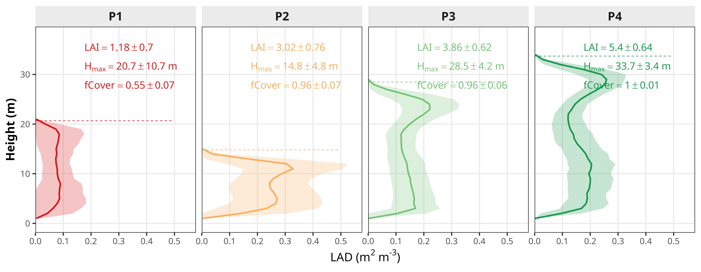{width="5.8in"}

**Fig 2 — Modes fonctionnels du profil (analyse en composantes principales
fonctionnelle).** Une analyse en composantes principales fonctionnelle des profils
résume leur forme verticale en trois modes, qui captent environ 87 % de la
variance de forme. La forme verticale du feuillage se laisse donc décrire par un
petit nombre de descripteurs, indépendants des variables scalaires.

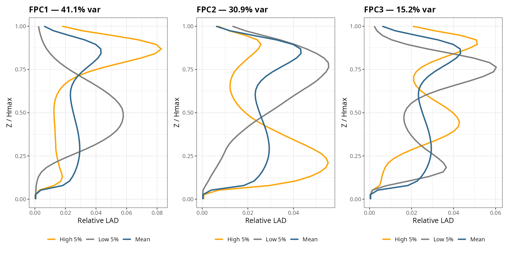{width="5.8in"}

**Fig 3 — Validation du regroupement par analyse en composantes principales.** Une
analyse en composantes principales sur les variables {LAI, fCover, hauteur, VCI}
sépare nettement les quatre clusters, le premier axe (environ 75 % de la variance)
correspondant à la densité. Le chevauchement partiel de P3 et P4 montre qu'un seul
scalaire ne suffit pas à les distinguer, ce qui justifie le recours au profil
complet.

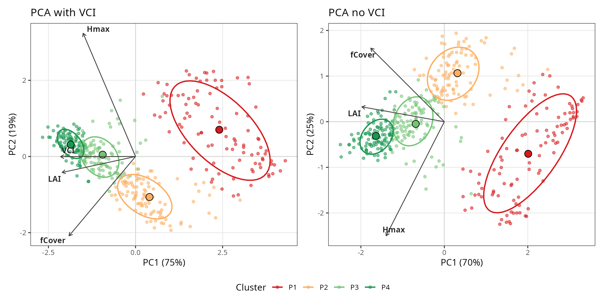{width="5.8in"}

**Fig 4 — Inhomogénéité verticale (VCI) par type.** L'indice VCI, qui mesure
l'uniformité verticale du feuillage, croît de façon monotone, sa médiane passant
de 0,33 (P1) à 0,60 (P4). L'axe d'inhomogénéité verticale est donc bien capturé
et augmente avec la densité.

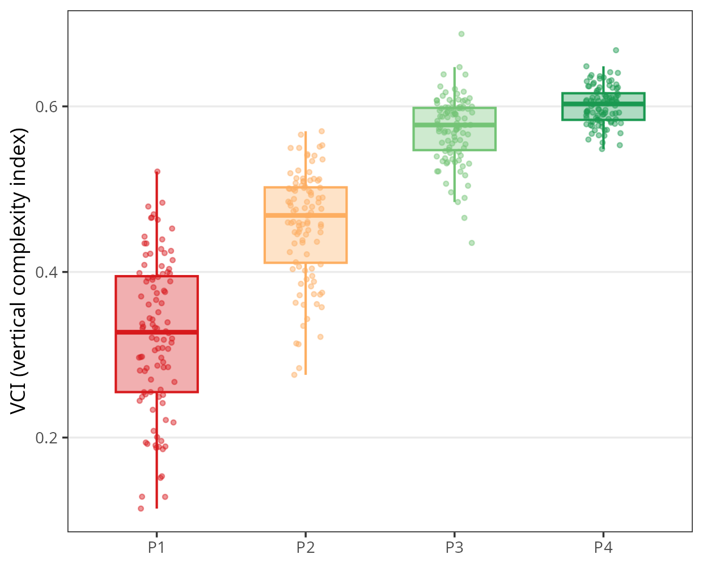{width="5.8in"}

**Fig 5 — Dispersion des traits par archétype et découplage hauteur–couvert.**
Distribution réalisée des trois traits scalaires (LAI une face, fCover, hauteur)
dans les 400 placettes du plan, par archétype (haut), et relation hauteur–couvert
par archétype (bas). La dispersion du LAI est quasi constante le long du gradient ;
le couvert sature vers 1 dans le dense ; en revanche la **dispersion de la hauteur
est de loin la plus forte dans l'archétype ouvert P1** (écart-type 10,7 m, étendue
4–40 m, contre 3,4 à 4,8 m ailleurs). La raison est un **découplage hauteur–couvert
au bout ouvert** : une canopée claire peut être jeune et basse *ou* mature, haute et
dégradée, de sorte que dans P1 la hauteur est presque décorrélée du couvert
(r = 0,07), alors que dans les types fermés P3–P4 hauteur et couvert sont verrouillés
ensemble. Cette hétérogénéité de P1 n'est pas un défaut du tirage mais une propriété
de la forêt : elle permet de sonder le levier « hauteur » indépendamment de la
densité là où la densité le laisse libre.

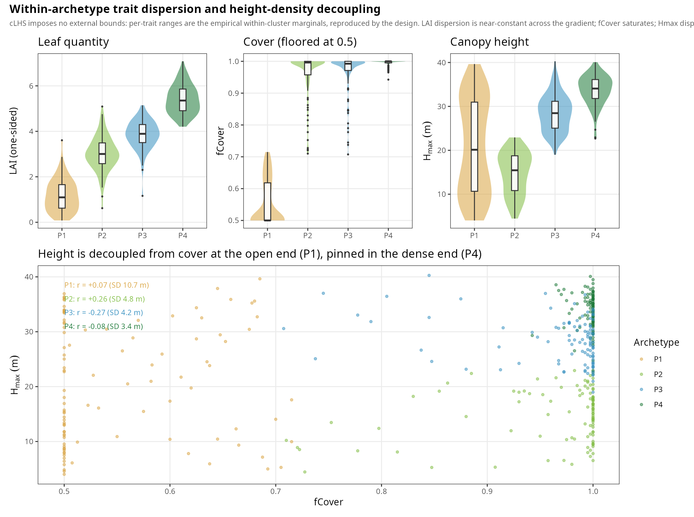{width="6.3in"}

## 5. Ce que change le couplage : effet direct et trait dominant (modèle à modèle ; Fig 6 à 8)

Avant de confronter chaque version aux observations, on quantifie d'abord ce que
le couplage à la couche limite (le « yoyo ») change *en soi* dans le microclimat
simulé. Les deux binaires étant exécutés sur exactement les mêmes 53 placettes et
le même forçage, on apparie leurs sorties placette par placette : l'écart entre
les deux versions ne dépend alors d'aucune mesure de terrain et isole l'effet
propre du raffinement physique.

**Fig 6 — Comparaison directe v3.2.0 vs v3.2.3 (modèle à modèle).** Pour chaque
métrique, chaque point est une placette ; l'abscisse porte la valeur v3.2.0,
l'ordonnée la valeur v3.2.3, la diagonale en tirets marquant l'égalité des deux
versions. Il en ressort un effet cohérent et systématique : **le yoyo amortit le
cycle diurne**. Il refroidit les maxima diurnes (ΔTmax des jours chauds : −0,48 °C
en moyenne, faisant passer le pic moyen de +0,42 °C à −0,06 °C, p < 10⁻⁴ ; ΔTmax
estival −0,35 °C) et comprime l'amplitude thermique quotidienne (DTR −0,73 °C),
tout en **relevant les minima nocturnes** (ΔTmin +0,39 °C, p < 10⁻⁸) — soit
davantage de tampon des deux côtés du cycle. Les pentes micro/macro baissent
légèrement (jour −0,03, nuit −0,04, ensemble −0,05). Le biais chaud moyen face au
macroclimat est, lui, **inchangé** (−0,04 °C, p = 0,44) : le yoyo redistribue le
cycle jour-nuit sans corriger le biais d'ensemble. Les deux versions restent par
ailleurs fortement corrélées en rang sur les métriques de tampon (r = 0,54 à 0,84),
sauf pour l'équilibre, instable lorsque la pente avoisine 1 (r = −0,49) et à
interpréter avec prudence. Le détail chiffré figure dans
`tables/tab_v320_v323_direct.csv`.

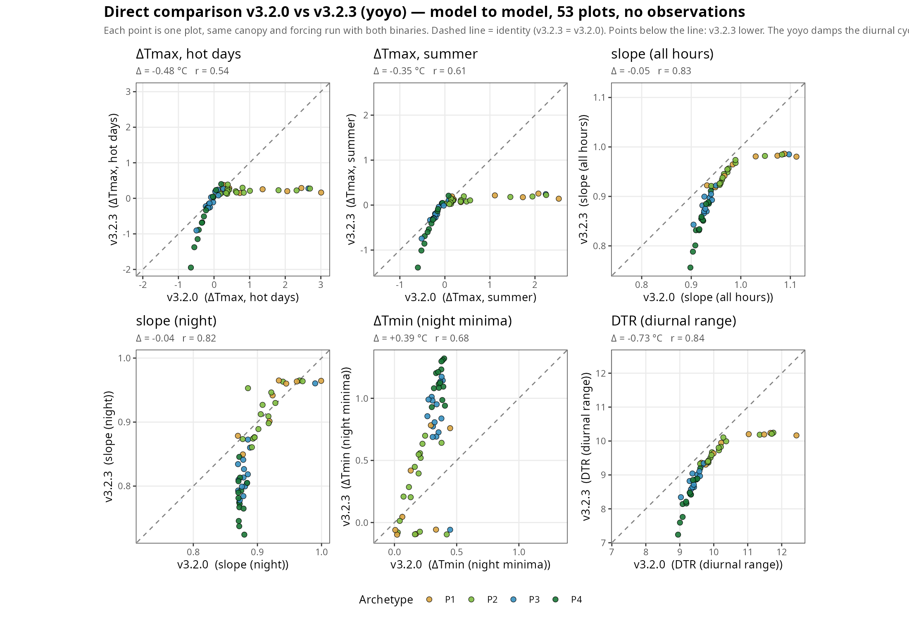{width="6.5in"}

Reste à savoir sur quel levier structural chaque version s'appuie. On le
détermine par une analyse d'importance des traits (perturbation des profils,
sans recours aux capteurs), avant de passer au verdict de terrain.

**Fig 7 — Importance des traits de structure par archétype.** On détermine quel
trait, de la quantité de feuillage (LAI) ou de la forme verticale du profil (LAD),
pilote le plus le microclimat, et ce afin de comprendre l'origine de la différence
entre versions. En v3.2.0, le LAI domine partout en s'érodant de P1 vers P4 ; en
v3.2.3, la forme verticale prend le dessus dans les peuplements denses. La version
v3.2.3 surpondère ainsi la forme verticale du feuillage.

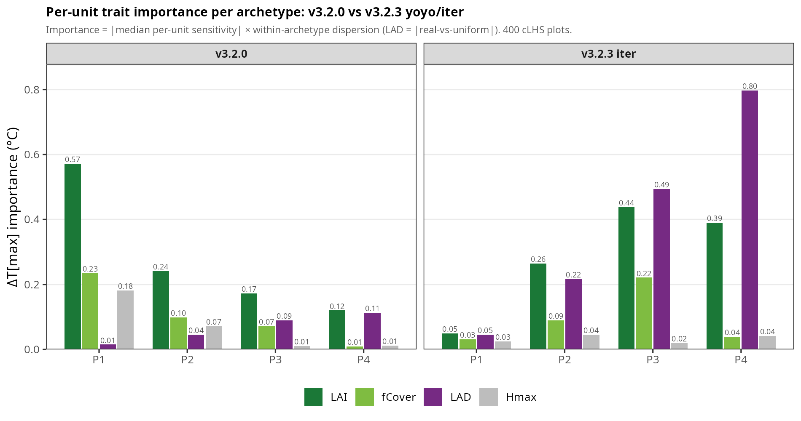{width="5.8in"}

**Fig 8 — Robustesse du contraste sur trois métriques et deux périodes.**
L'analyse d'importance est répétée pour trois métriques et deux périodes, afin de
vérifier que le contraste entre versions ne tient pas à une métrique particulière.
L'opposition entre la v3.2.0, dominée par le LAI, et la v3.2.3, dominée par la
forme verticale dans le dense, se maintient sur l'ensemble des combinaisons,
établissant une différence structurelle entre les binaires.

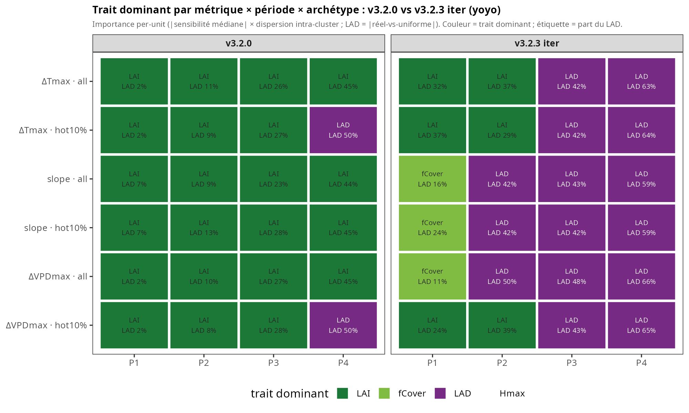{width="5.8in"}

## 6. Comparaison des deux versions, confrontées aux observations (Fig 9 à 14)

**Fig 9 — Validation de terrain du ΔTmax par placette.** Le ΔTmax simulé par
chaque binaire est confronté aux 53 capteurs, ce qui constitue le test de réalité
direct. La version v3.2.0 atteint une corrélation de 0,93, avec un nuage resserré
autour de la diagonale, tandis que la version v3.2.3 ne dépasse pas 0,63, son
nuage étant quasi plat. Sur ce critère d'accord linéaire au pic de chaleur, la
version v3.2.0 reproduit donc mieux les observations, la version v3.2.3 ayant
tendance à écraser les écarts entre placettes. Il convient de noter que cette
corrélation est un coefficient de Pearson, sensible à quelques placettes extrêmes,
point que les sections suivantes nuanceront.

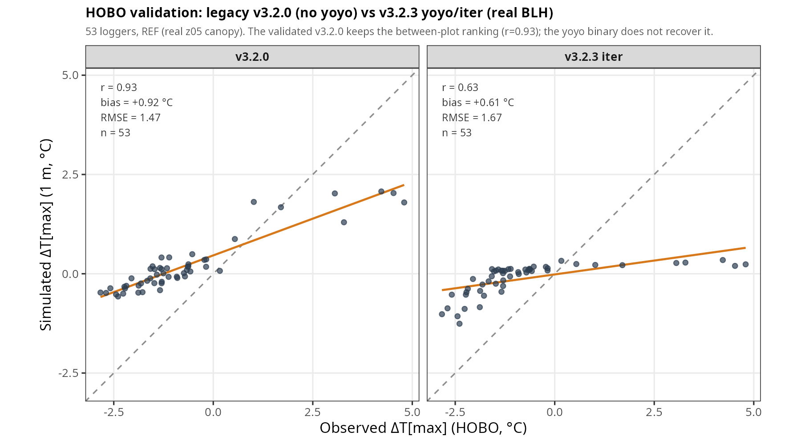{width="5.8in"}

**Fig 10 — Température horaire brute.** La comparaison des 155 016 températures
horaires simulées et observées vise à déterminer si la différence entre versions
se situe dans le suivi grossier ou dans la structure fine. Le coefficient de
détermination atteint environ 0,78 pour les deux versions (erreur d'environ 2,4 °C,
biais de +1,1 °C). La température brute est donc équivalente, la différence se
logeant non dans le suivi horaire global mais dans la structure fine entre
placettes.

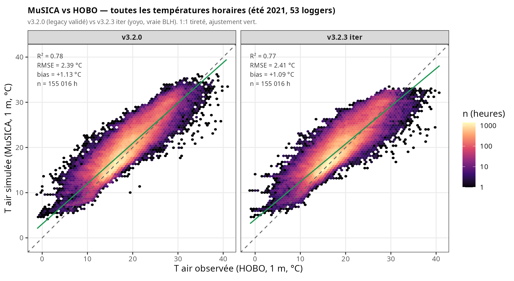{width="5.8in"}

**Fig 11 — ΔTmax et pente par placette (été et 10 % chauds).** Les diagrammes
simulé-observé, à panneaux carrés et diagonale réelle, évaluent la fidélité
placette à placette des deux indicateurs de tampon. La version v3.2.0 l'emporte
sur les quatre cas : le coefficient de détermination du ΔTmax y est de 0,87 et 0,75
contre 0,40 et 0,32, et celui de la pente de 0,92 et 0,87 contre 0,61 et 0,50.

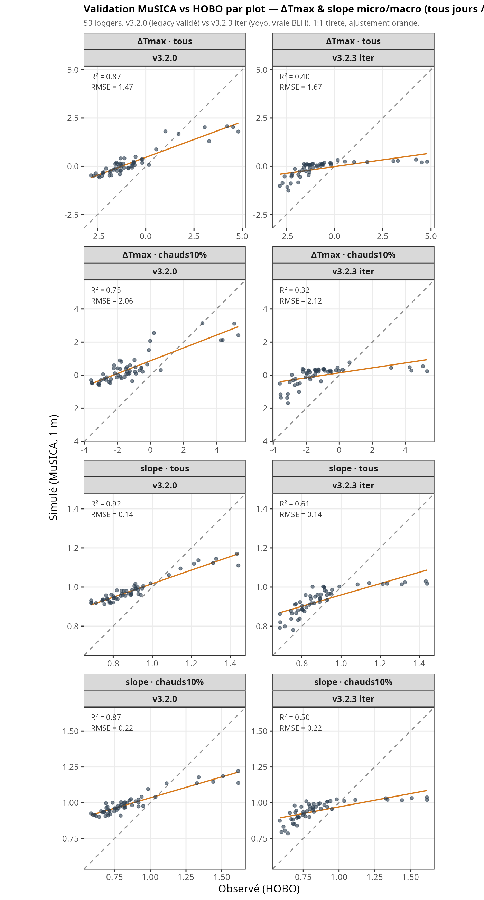{width="5.0in"}

**Fig 12 — Sensibilité sur les profils moyens.** La perturbation des traits sur
les quatre profils moyens, conduite à titre de vérification, donne un effet modéré
en v3.2.0, exception faite d'un artefact en P1 imputable au caractère non
représentatif du profil moyen. Le calcul sur les 400 placettes réelles demeure de
ce fait la référence.

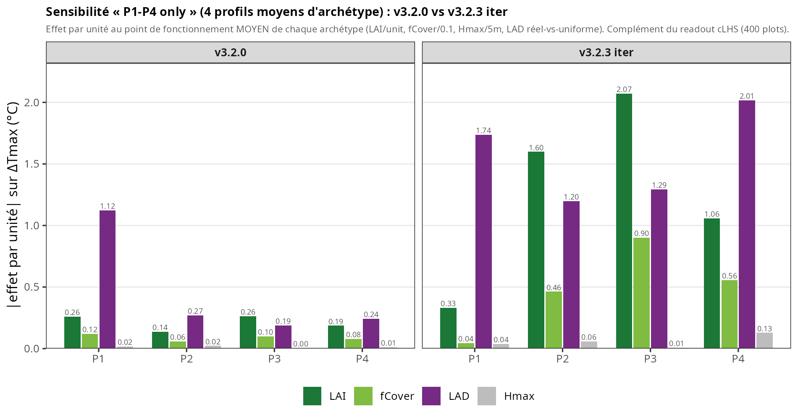{width="5.8in"}

**Fig 13 — Skill de classement et incertitude.** La corrélation entre placettes
est assortie d'intervalles de confiance obtenus par 3000 rééchantillonnages, afin
d'établir si l'avantage de la v3.2.0 est significatif. Les intervalles sont
disjoints sur les quatre métriques (Δr de +0,18 à +0,30, p ≤ 0,005). Sur le
coefficient de Pearson, la version v3.2.0 est donc significativement meilleure ;
les sections suivantes montreront toutefois que cet écart se referme, voire
s'inverse, sur le rang de Spearman.

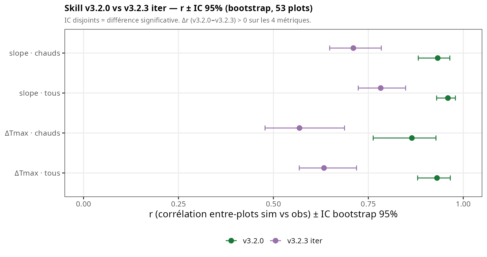{width="5.8in"}

**Fig 14 — Erreur absolue appariée.** La comparaison de l'erreur absolue placette
par placette, par test de Wilcoxon apparié, sépare l'erreur de niveau (biais) de
l'erreur de structure. La version v3.2.3 présente l'erreur la plus faible, en
raison d'un moindre biais chaud, significativement pour la pente et le ΔTmax des
journées chaudes. La version v3.2.3 l'emporte ainsi sur le niveau, non sur la
structure spatiale.

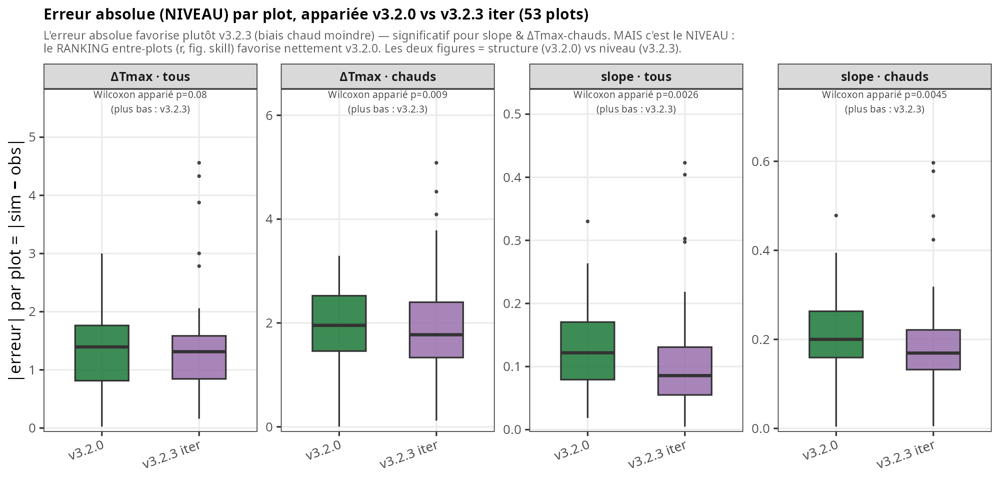{width="5.8in"}

## 7. Analyse fine du microclimat (Fig 15 à 21)

La comparaison précédente juge essentiellement l'accord linéaire au pic de chaleur.
On la prolonge ici en distinguant nettement classement et amplitude, en décomposant
le jour et la nuit ainsi que l'été et les canicules, et en examinant la structure
verticale de la canopée. L'objectif est double : déterminer si le verdict en
faveur de la v3.2.0 résiste à un changement de critère, et comprendre l'origine
physique des différences.

**Rappel — classement et amplitude.** Le *classement* est la capacité du modèle à
mettre les placettes dans le bon ordre, de la plus fraîche à la plus chaude,
mesurée par la corrélation de rang de Spearman ρ ; l'*amplitude* est sa capacité à
restituer la bonne magnitude des écarts, mesurée par le rapport de la dispersion
simulée à la dispersion observée. Les deux sont indépendantes : un modèle qui
prédirait −1,5 / −1,0 / −0,5 °C là où l'on observe −3 / −2 / −1 °C classe
parfaitement (ρ = 1) tout en écrasant l'amplitude de moitié. Pour cartographier des
refuges, c'est le classement qui prime — savoir *quelles* placettes sont les plus
fraîches ; pour annoncer une magnitude (« −X °C à midi »), c'est l'amplitude. Le
coefficient de Pearson, lui, mélange les deux et se laisse piéger par quelques
placettes extrêmes, d'où la nécessité de les séparer.

**Fig 15 — Amplitude et classement.** Appliquant la distinction rappelée ci-dessus,
on sépare, pour la pente et le ΔTmax, l'amplitude restituée (rapport des
dispersions) du classement (ρ de Spearman). Sur la pente, les deux versions
compriment l'amplitude de façon identique (31 %), mais la v3.2.3 ordonne mieux les
placettes (ρ de 0,92 contre 0,90) ; sur le ΔTmax, la v3.2.0 restitue davantage
d'amplitude (44 % contre 20 %) tout en classant légèrement moins bien (ρ de 0,90
contre 0,86). Le déficit de Pearson de la v3.2.3 (Fig 9) tient donc à quelques
placettes extrêmes plutôt qu'à l'ordre des placettes — ce que la figure suivante
isole directement.

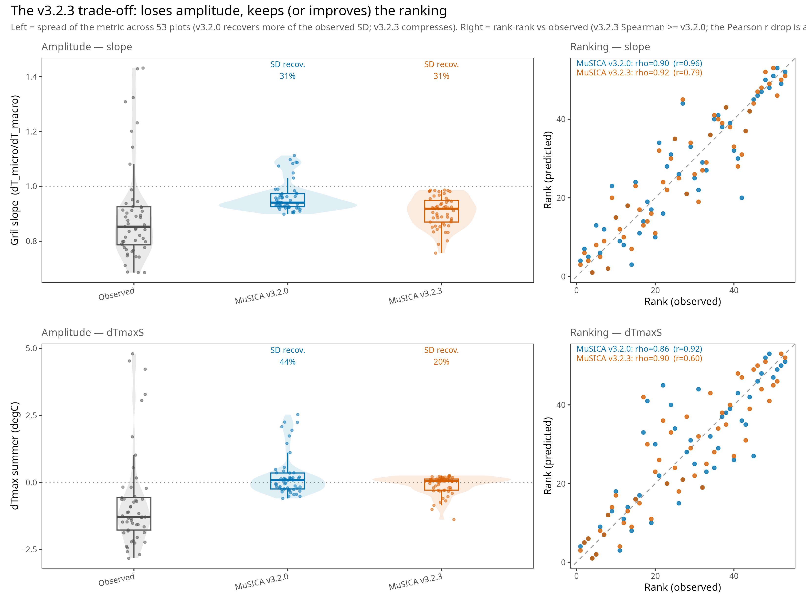{width="6.0in"}

**Fig 16 — Séparation des placettes amplificatrices et tampons.** Pour vérifier
directement cette explication, on sépare les placettes selon le signe du ΔTmax
observé : les *amplificatrices*, trouées ouvertes qui se réchauffent (ΔTmax > 0 ;
neuf placettes, dont les deux ou trois trouées extrêmes évoquées ci-dessus), et les
*tampons*, sous-bois fermé qui rafraîchit (ΔTmax < 0 ; quarante-quatre placettes,
soit les refuges visés par une cartographie). Le résultat est net. Sur l'ensemble,
le Pearson de la v3.2.3 chute (0,92 → 0,60) alors même que son classement de
Spearman *progresse* (0,86 → 0,90). Cette chute est portée **entièrement** par les
neuf trouées, où la v3.2.3 aplatit le ΔTmax vers zéro (amplitude de 42 % à 2 %,
Pearson de 0,67 à 0,22) et déforme ainsi la régression globale. Sur les
quarante-quatre placettes tampons, à l'inverse, la v3.2.3 **dépasse** la v3.2.0 sur
les trois critères simultanément : classement (ρ de 0,79 à 0,84), accord linéaire
(r de 0,74 à 0,81) et amplitude (de 41 % à 51 %). Là où se joue la cartographie de
refuges, le couplage n'introduit donc aucune dégradation — il améliore même la
restitution ; sa seule faiblesse concerne les trouées chaudes, dont il sous-estime
l'amplification. L'effectif des trouées étant modeste (n = 9), ce dernier point se
lit comme une tendance. Le détail est dans `tables/tab_v320_v323_ampbuff.csv`.

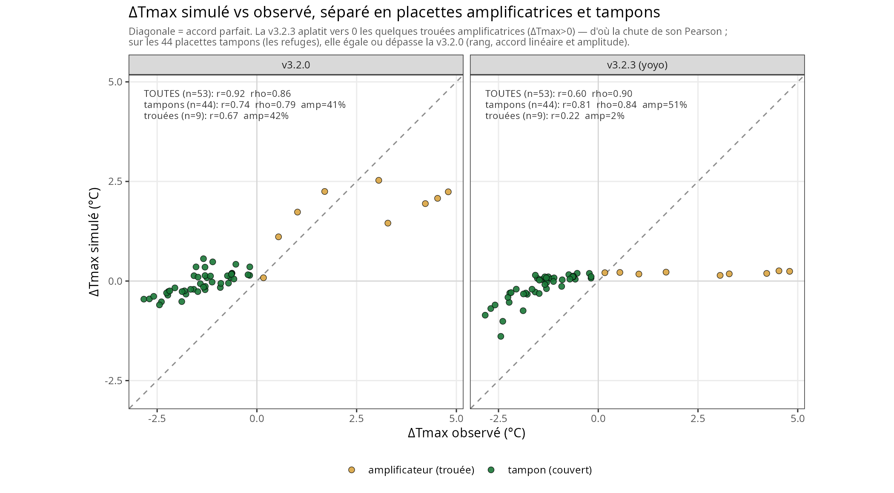{width="6.5in"}

**Robustesse du verdict — le ΔTmax sans les neuf trouées.** En prolongeant
directement cette séparation, on recalcule l'accord du ΔTmax avec l'observation une
fois retirées les neuf trouées amplificatrices. La chute globale du Pearson de la
v3.2.3 se révèle un artefact de ces seules placettes :

| Version | Périmètre | Pearson | Spearman | Amplitude |
|---|---|---|---|---|
| v3.2.0 | toutes (53)        | 0,92 | 0,86 | 44 % |
| v3.2.0 | sans trouées (44)  | 0,74 | 0,79 | 41 % |
| v3.2.3 | toutes (53)        | 0,60 | 0,90 | 20 % |
| v3.2.3 | sans trouées (44)  | **0,81** | 0,84 | 51 % |

Une fois les neuf trouées retirées, le Pearson de la v3.2.3 (0,81) **dépasse** celui
de la v3.2.0 (0,74) : le verdict apparent de la Fig 9 s'inverse dès qu'on écarte les
trouées atypiques, et le classement de Spearman de la v3.2.3 reste supérieur en
toutes circonstances (0,90 sur l'ensemble). Le détail est dans
`tables/tab_v320_v323_robustness.csv`.

**Fig 17 — Grille complète : classement et amplitude, par moment et par période.**
Deux cartes de chaleur, l'une pour le classement de Spearman, l'autre pour
l'amplitude, couvrent la pente et l'offset thermique selon le moment (jour, nuit,
ensemble) et la période (été, 10 % chauds), de manière à embrasser l'ensemble des
cas sans sélection arbitraire. Pour le classement, la version v3.2.3 égale ou
surpasse la v3.2.0 dans la quasi-totalité des cellules, la v3.2.0 allant jusqu'à
inverser l'ordre sur l'équilibre et sur la pente diurne des journées chaudes. Pour
l'amplitude, le partage s'opère selon le moment : la v3.2.0 détient l'amplitude
diurne, la v3.2.3 l'amplitude nocturne. Pour ordonner les placettes, finalité
d'une cartographie de refuges, la v3.2.3 constitue donc le choix le plus sûr ;
pour la magnitude diurne, la v3.2.0.

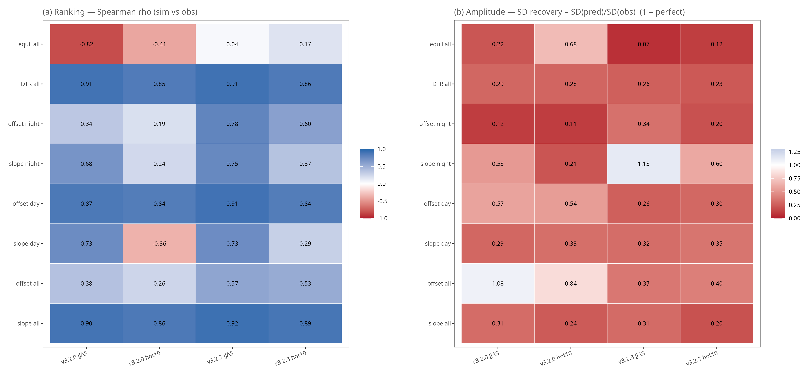{width="6.5in"}

**Fig 18 — Axes complémentaires : jour et nuit, amplitude quotidienne, minima
nocturnes, suivi temporel.** La pente est calculée séparément de jour et de nuit,
de même que l'amplitude thermique quotidienne, le tampon des minima nocturnes et
la corrélation temporelle propre à chaque placette ; le couplage atmosphérique de
la v3.2.3 agissant surtout la nuit, on cherche à le mettre en évidence. La nuit,
la v3.2.3 l'emporte nettement : pour la pente nocturne, le classement passe de
0,68 à 0,75 et l'amplitude restituée de 53 % à 113 % ; pour les nuits froides, la
corrélation passe de 0,47 à 0,82, la v3.2.0 demeurant quasi plate. Le suivi
temporel est en revanche équivalent (corrélation d'environ 0,89), et la v3.2.3
sous-estime légèrement l'amplitude jour-nuit (biais de −0,70 °C). Le point faible
de la v3.2.3 est donc diurne ; de nuit et sur les minima, elle est nettement
supérieure.

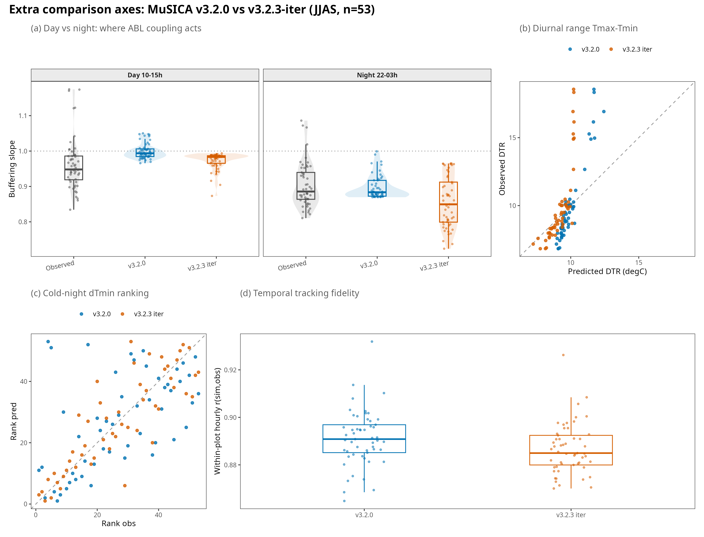{width="6.0in"}

**Fig 19 — Profils verticaux de température, de vent, d'humidité et de VPD.** Du
sol au sommet de la canopée, les profils moyens de quatre variables sont tracés
pour les archétypes P1 à P4 et pour les deux binaires, de jour comme de nuit, afin
de comprendre mécaniquement où et comment les versions diffèrent, un modèle
unidimensionnel redistribuant la chaleur verticalement. De jour, en canopée
ouverte (P1), le sous-bois se réchauffe fortement en v3.2.0 (+2,95 °C, VPD de
+0,35 kPa, jusqu'à +3,5 °C et +0,64 kPa en canicule), tandis que la v3.2.3 aplatit
ce réchauffement. De nuit, en peuplement dense, la v3.2.3 renforce l'inversion, le
sous-bois devenant plus chaud que le sommet de +0,3 à +0,8 °C. Le vent, enfin, est
davantage freiné près du sol par la v3.2.3, dont le cisaillement vertical est plus
prononcé en toutes conditions. Le couplage atmosphérique de la v3.2.3 supprime
ainsi le réchauffement convectif du sous-bois ouvert de jour, ce qui explique sa
faiblesse sur les pics chauds, et renforce le découplage nocturne, ce qui
constitue sa force ; on reconnaît là sa signature physique.

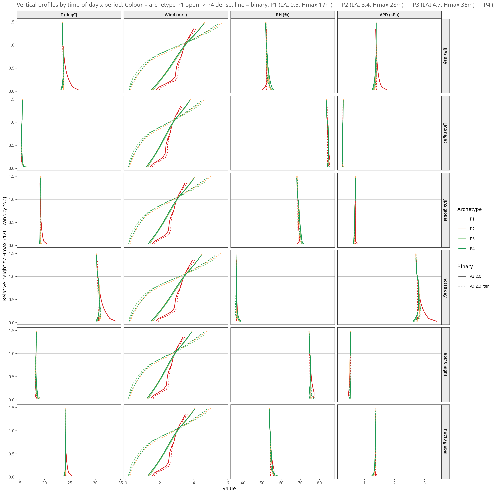{width="5.5in"}

**Fig 20 — Modèle physique et modèle statistique de la pente.** La pente prédite
par MuSICA, pour les deux binaires et en aveugle (les capteurs ne sont jamais vus
par le modèle), est comparée à celle d'une régression statistique (méthode de
Gril, calibrée par validation croisée par omission sur la structure de canopée),
afin de situer le modèle physique par rapport à une référence empirique et de
tester la métrique de Gril. La version v3.2.0 classe très bien (corrélation de
0,96) mais comprime l'amplitude (coefficient de détermination de 0,36) ; la v3.2.3
atteint 0,79 ; la régression recale l'amplitude (coefficient de détermination de
0,87). Sur l'équilibre, la v3.2.0 inverse l'ordre, par un artefact mathématique
survenant lorsque la pente avoisine 1. Surtout, MuSICA classe aussi bien que la
régression, la différence n'étant pas significative au test de Williams. Le modèle
physique sait donc quelles placettes tamponnent, mais non de combien ; un modèle
statistique ne le surpasse que sur la calibration d'amplitude, non sur l'ordre.

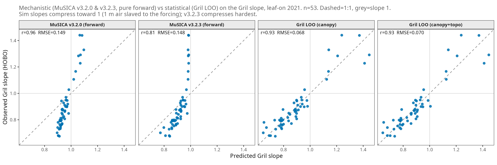{width="6.0in"}

**Fig 21 — Synthèse statistique : incertitudes, significativité et attribution.**
Les corrélations sont assorties d'intervalles de confiance bootstrap par modèle et
par métrique, complétés du test de Williams et d'une attribution du tampon observé.
La version v3.2.0 surpasse la v3.2.3 sur le Pearson (p < 0,0001), mais le modèle
physique égale la régression sur le rang. Le tampon observé s'explique à 84 % par
la canopée (quantité de feuillage et couverture), la topographie n'y ajoutant
presque rien, l'exposition (northness) ne jouant qu'à la marge et sur le seul
ΔTmax. L'enrichissement de la prédiction du feuillage par la topographie la dégrade
même légèrement, le terrain n'informant pas la densité de canopée. Le moteur du
microclimat est donc la canopée, le relief n'étant qu'une retouche secondaire.

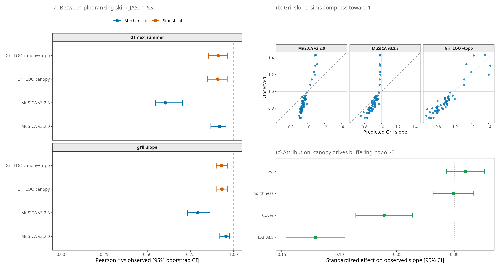{width="6.5in"}

## 8. Synthèse : origine structurale des différences et fidélité du gradient (Fig 22 à 25)

On synthétise ici l'origine et la portée des différences, sans nouvelle simulation,
sur quatre points : l'effet du couplage par archétype, la préservation du gradient
écologique observé, une vue d'ensemble par diagramme de Taylor, et les conditions
structurales de la divergence entre binaires.

**Fig 22 — Effet du couplage par archétype.** On moyenne, par type de canopée, la
différence entre versions Δ = v3.2.3 − v3.2.0 de chaque métrique. L'effet du yoyo
n'est pas uniforme mais **contrasté entre jour et nuit selon la densité** : le
refroidissement diurne (ΔTmax) est concentré dans l'ouvert (P1, ≈ −0,9 °C) et
s'éteint vers le dense, tandis que le réchauffement nocturne (ΔTmin, +0,8 °C en P4)
et la baisse de la pente nocturne se concentrent au contraire dans le dense. C'est
la signature physique attendue : le couplage à la couche limite agit sur la
convection diurne des trouées et sur l'inversion nocturne des peuplements fermés.

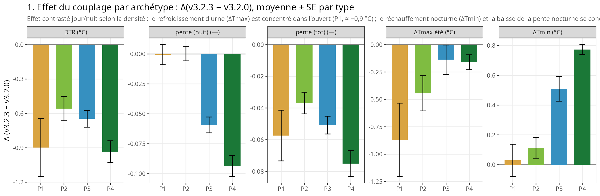{width="6.5in"}

**Fig 23 — Préservation du gradient observé de tampon P1 → P4.** Le ΔTmax estival
moyen observé décroît fortement et de façon monotone de l'ouvert (trouée chaude,
+0,8 °C) au dense (sous-bois frais, −1,9 °C). Les deux versions retrouvent l'ordre,
mais leur fidélité à la **magnitude** diffère nettement : la v3.2.0 conserve un
gradient marqué (+1,0 à −0,3 °C), alors que la v3.2.3 l'**aplatit presque
entièrement** (+0,2 à −0,5 °C). Pour la question centrale d'une cartographie — la
décroissance du tampon avec la densité, mesurée en ΔTmax — la v3.2.0 reproduit donc
mieux l'amplitude du signal écologique, ce qui conforte son choix pour cet usage.

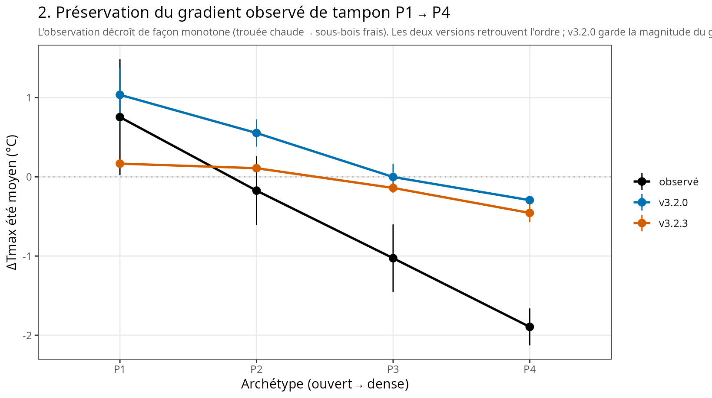{width="6.0in"}

**Fig 24 — Diagramme de Taylor (normalisé).** Cette synthèse place chaque métrique
et chaque version selon sa corrélation avec l'observation (angle) et son amplitude
relative (rayon ; 1 = amplitude observée). Elle confirme d'un coup d'œil les deux
constats : les points des deux versions se tiennent à corrélation élevée mais à
amplitude réduite (rayon < 1, les deux versions sous-dispersent), et la v3.2.3 se
distingue surtout en amplitude nocturne (pente de nuit), seule métrique où elle
restitue davantage de dispersion que la v3.2.0.

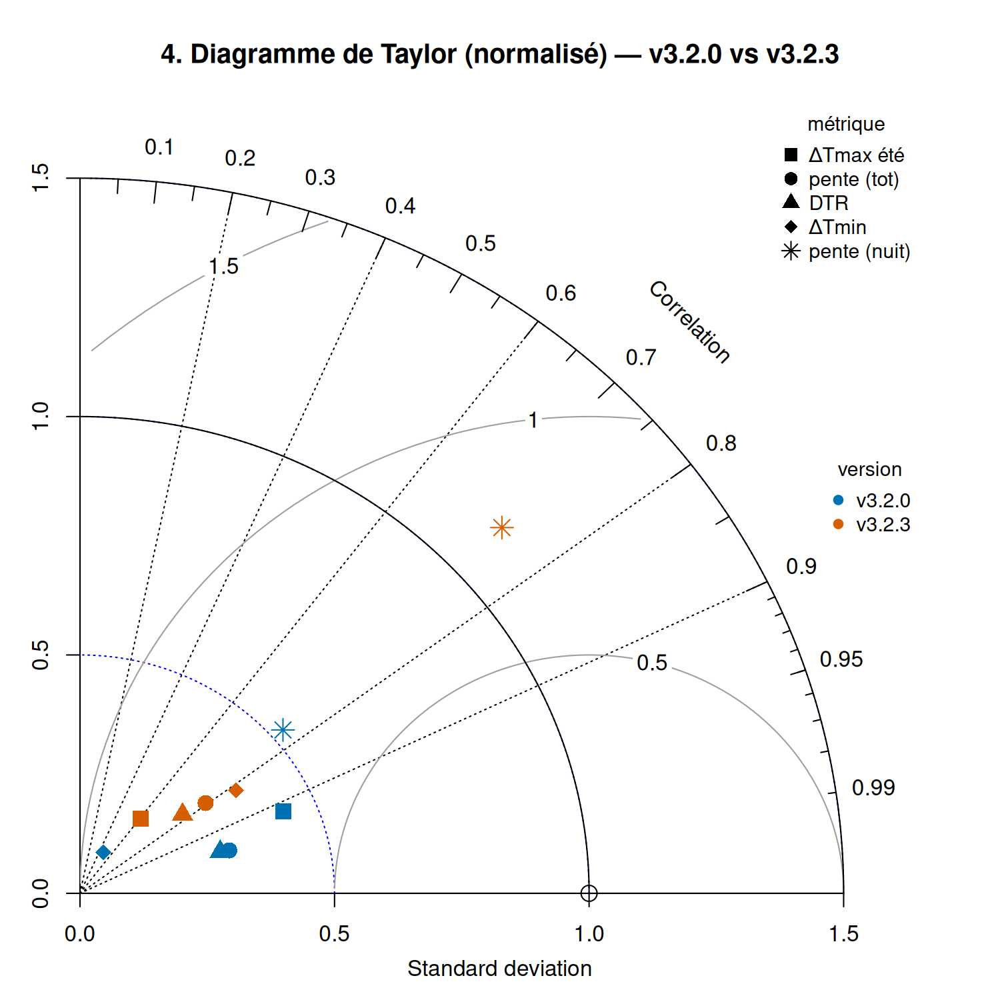{width="4.8in"}

**Fig 25 — Origine structurale de la divergence.** On régresse enfin l'écart absolu
entre versions, |v3.2.3 − v3.2.0| sur le ΔTmax, sur les quatre traits de structure
(coefficients standardisés ; R² = 0,81). La divergence est presque entièrement
prévisible à partir de la structure : elle est maximale dans les peuplements à
faible complexité verticale (VCI, coefficient le plus fort), peu couvrants (fCover)
et hauts (*H*~max~), c'est-à-dire les trouées ouvertes et étagées — là précisément
où le couplage à la couche limite modifie la convection. Là où la canopée est
fermée (P3, P4), les deux binaires sont quasiment interchangeables (divergence
proche de zéro).

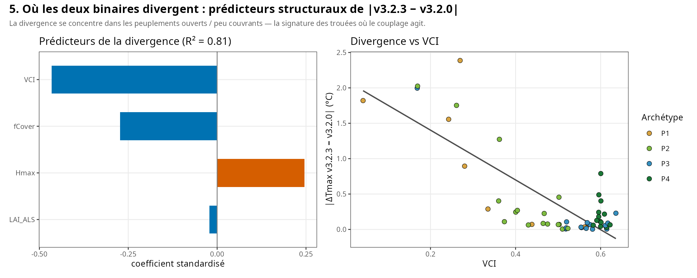{width="6.5in"}

## 9. Conclusion

La comparaison de base (Fig 9 à 14) établit que, sur l'accord linéaire au pic de
chaleur, la version v3.2.0 reproduit mieux la structure spatiale, ses corrélations
étant significativement plus élevées, tandis que la version v3.2.3 présente un
meilleur niveau, avec un biais moindre. La température horaire brute est
équivalente.

L'analyse fine (Fig 15 à 21) précise ce constat sur quatre points. Premièrement,
sur le rang de Spearman, la version v3.2.3 égale ou surpasse la v3.2.0 ; son
déficit de Pearson provient de quelques placettes ouvertes extrêmes et non de
l'ordre des placettes. Deuxièmement, l'amplitude se partage selon le moment de la
journée : la v3.2.0 détient l'amplitude des extrêmes chauds diurnes, la v3.2.3
celle du régime nocturne, dont les nuits froides. Troisièmement, la structure
verticale révèle que la v3.2.3 amortit le réchauffement diurne du sous-bois ouvert
et renforce le découplage nocturne ainsi que le freinage du vent, signature
attendue de son couplage atmosphérique. Quatrièmement, l'effet tampon procède de
la canopée (84 % de la variance expliquée), la topographie ne jouant qu'à la
marge, et le modèle physique classe aussi bien qu'une régression empirique.

La synthèse (Fig 22 à 25) referme le raisonnement : les deux binaires ne divergent
que dans les trouées ouvertes, hautes et peu étagées — en canopée fermée, ils sont
quasiment interchangeables — et la v3.2.0 préserve mieux la magnitude du gradient
de tampon le long de la densité, ce qui justifie son choix lorsque la cible est ce
gradient diurne.

Il ne s'agit donc pas de rejeter en bloc la version v3.2.3. Lorsque la cible est
l'amplitude des extrêmes chauds diurnes, telle la fonction de refuge en canicule
évaluée par la validation du ΔTmax, la version v3.2.0 est préférable. Lorsque la
cible est une cartographie ordonnée des refuges, transférable à d'autres sites, ou
le régime nocturne, la version v3.2.3 est au moins aussi bonne, voire meilleure.
En somme, la version v3.2.0 privilégie la fidélité d'amplitude diurne et la version
v3.2.3 la robustesse du classement et la physique nocturne ; le choix se détermine
selon la question thermique mise en avant dans le chapitre.

*Reproductibilité : les figures et les tables sont régénérées par les scripts du
répertoire `comparaison_versions/scripts/`, exécutés depuis la racine du projet.
Le détail analyse par analyse figure dans `README_extension_microclimat.md`.*
