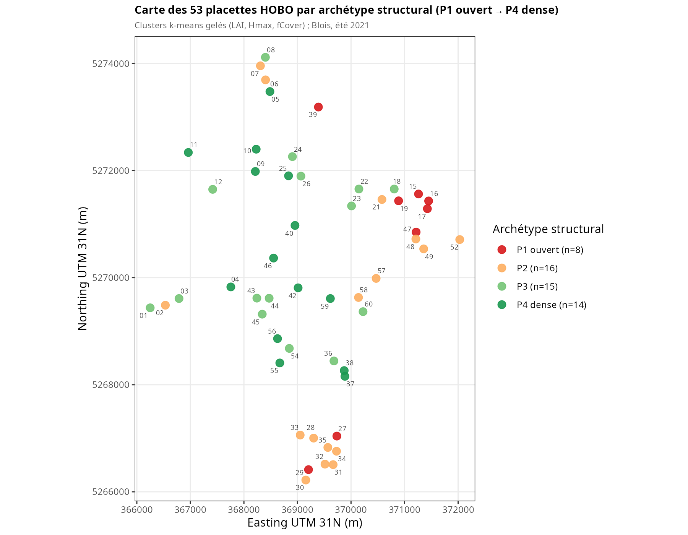
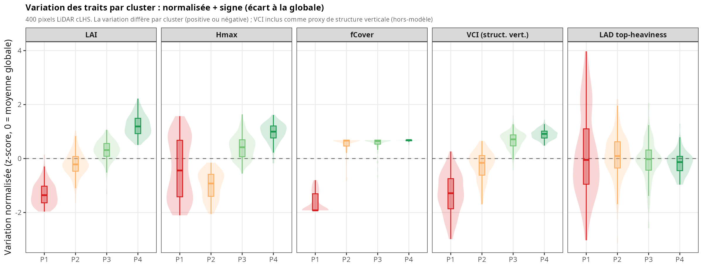
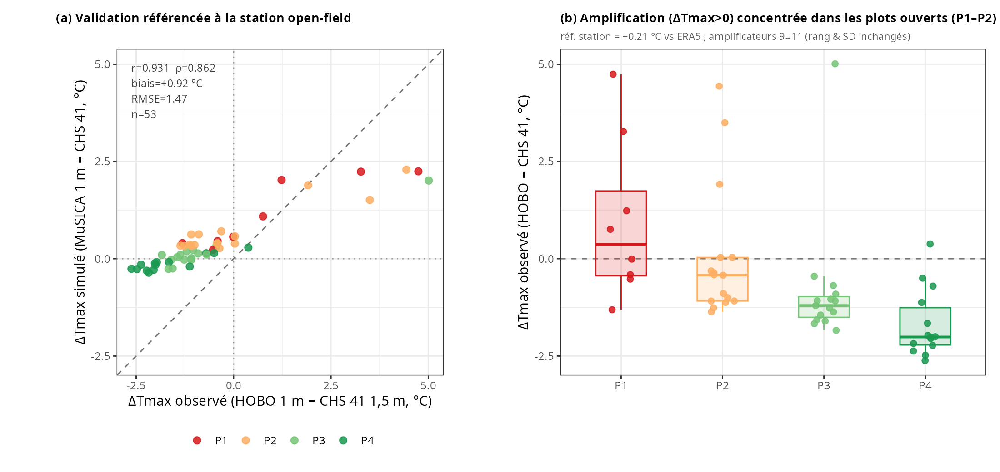
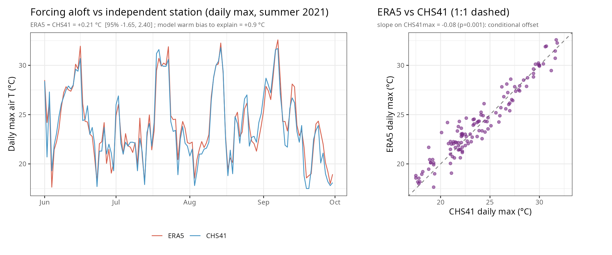
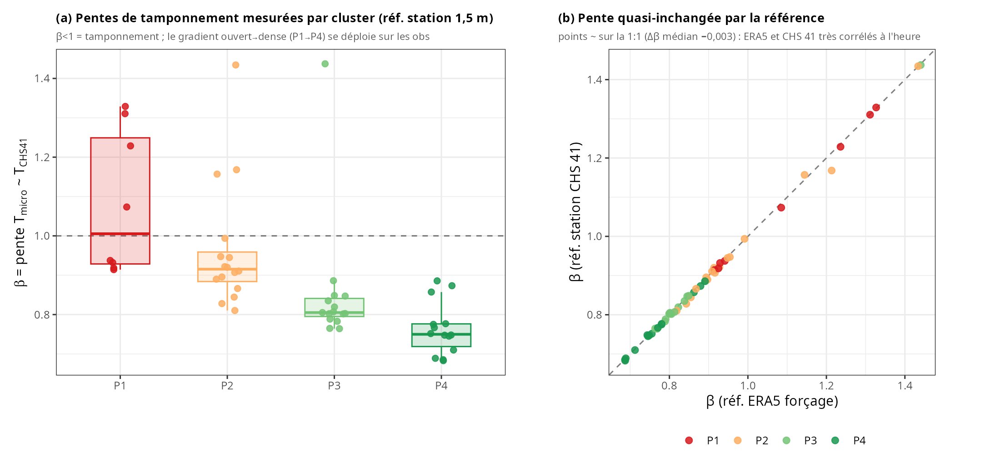
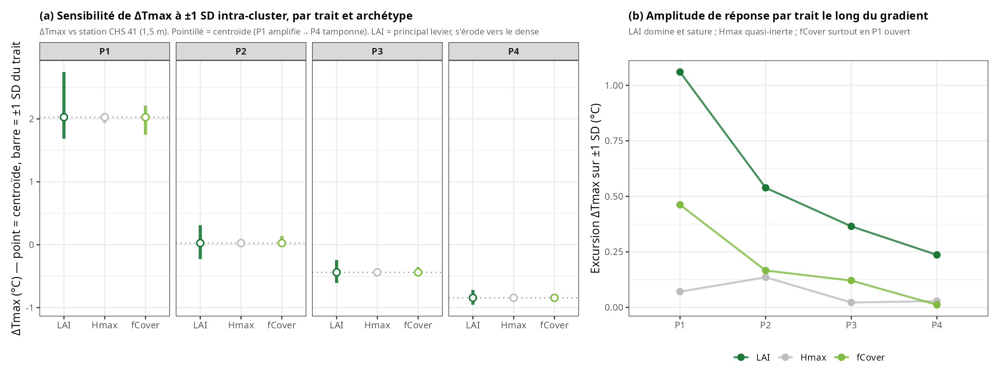
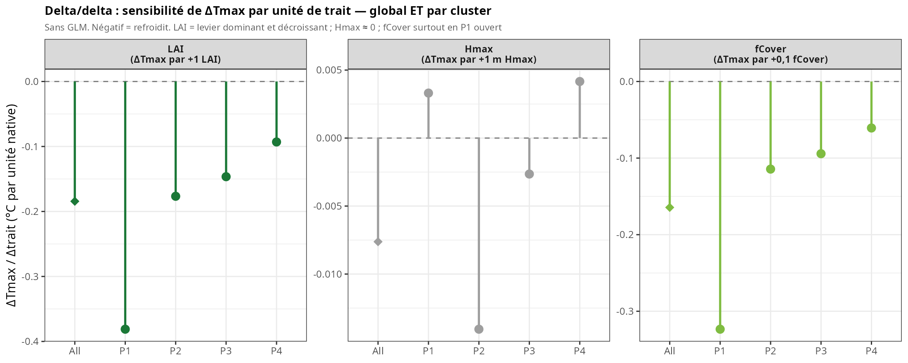
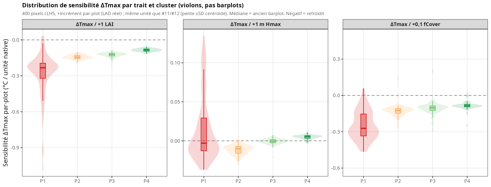
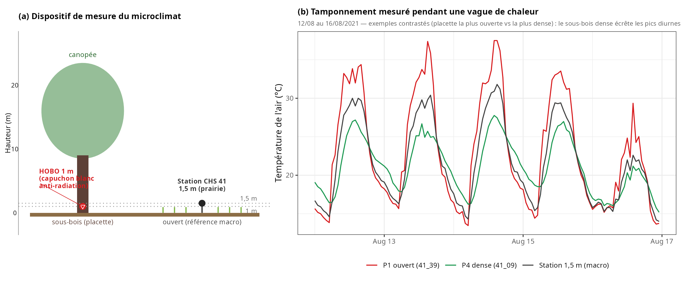

# Réunion 26/06/2026 — Structure → microclimat : référence station, sensibilité par archétype

*Document autonome répondant aux notes de la réunion. Toutes les sorties sur le
binaire **validé v3.2.0**, palette thermique d'archétype (P1 ouvert/chaud rouge →
P4 dense/froid vert). Chaque figure est accompagnée de sa **fiche 5-champs**
(méthodes · pré-traitements · données/figure · description · interprétation).*

**Données communes.** 53 placettes HOBO (capteur air à 1 m, position « a »),
Blois, été 2021 ; structure LiDAR plein (LAI, Hmax, fCover, VCI, profil LAD) ;
typologie k-means gelée en 4 archétypes ; plan cLHS de 400 *vrais pixels LiDAR*
(100/archétype). Référence macroclimat = **station RENECOFOR CHS 41, prairie,
1,50 m** (`MetHor2021.txt`), au lieu du forçage free-air ERA5.

---

## Contexte et fil conducteur

La réunion a demandé trois déplacements : (1) **changer la référence** de ΔTmax du
forçage ERA5 vers la **station de terrain** (1,5 m), avec l'écart de hauteur
HOBO 1 m / station 1,5 m explicité et le biais forçage↔station remis en annexe ;
(2) **ouvrir la boîte de la sensibilité** par archétype — montrer *en quoi* MuSICA
est sensible à la structure {LAI, LAD, Hmax, fCover}, en faisant varier chaque
trait de **sa propre SD intra-cluster** ; (3) **présentation** — éviter les
barplots, colorer par cluster, carte des archétypes, et une figure terrain pour
la conférence MEB.

Le résultat d'ensemble se résume en une phrase : **la quantité de feuillage (LAI)
est le levier microclimatique de premier ordre dans MuSICA et sa sensibilité
s'érode du peuplement ouvert vers le dense (saturation) ; la hauteur (Hmax) est
quasi-inerte une fois LAI et couvert fixés ; et le classement des refuges comme
le gradient de tamponnement sont robustes au choix de la référence.**

---

## §1 — Mise en place : typologie et variabilité structurale

### Fig 1 — Carte des 53 placettes par archétype

- **Méthodes.** Coordonnées UTM 31N des placettes (geojson) coloriées par
  l'archétype k-means (assignation gelée).
- **Pré-traitements.** 53/60 placettes retenues (`ids_to_remove` exclus).
- **Données/figure.** `c1_archetype_map.R` → `Fig1_carte_archetypes.png`.
- **Description.** P1 ouvert (n=8), P2 (16), P3 (15), P4 dense (14), répartis sur
  l'ensemble du massif sans ségrégation spatiale forte.
- **Interprétation.** Les archétypes ne sont pas un effet de localisation : ils
  échantillonnent la structure à travers tout le site.

### Fig 2 — Variation des traits par cluster (+ VCI)

- **Méthodes.** Pour chaque trait, distribution intra-cluster en **z-score**
  (0 = moyenne globale) → lecture simultanée du **signe** (écart à la globale) et
  de la **dispersion**. Inclut le **VCI** (proxy de structure verticale, hors
  entrée du modèle) et un scalaire LAD (hauteur du centre de masse relatif).
- **Pré-traitements.** 400 pixels cLHS ; LAD moyenné par couche.
- **Données/figure.** `c1_trait_variation_cluster.R` → `tab_trait_variation_cluster.csv`.
- **Description.** LAI monotone (signe − en P1 → + en P4) ; **Hmax non-monotone**
  (P2 le plus court ; P1 à très forte dispersion, SD ≈ 10,7 m) ; fCover fortement
  négatif et étalé seulement en P1 (saturé ≈ 1 ailleurs) ; VCI monotone ; LAD
  top-heaviness quasi-plat.
- **Interprétation.** **« La variation n'est pas la même par cluster, positive ou
  négative »** : c'est ce qui justifie de perturber chaque trait de *sa propre SD*
  (Fig 6) plutôt qu'une SD commune. Le découplage hauteur–densité en P1 (Hmax très
  variable à couvert faible) est la signature de l'ouvert.

---

## §2 — Référence station (CHS 41, 1,5 m)

### Fig 3 — ΔTmax référencé à la station open-field

- **Méthodes.** ΔTmax = max journalier (HOBO 1 m ou MuSICA 1 m) − max journalier
  de la station CHS 41 (≥ 20 h/jour). Validation modèle–obs + comptage
  amplificateurs (ΔTmax > 0) par cluster.
- **Pré-traitements.** Re-référencement à partir des séries journalières
  ERA5-référencées : `ΔTmax_station = ΔTmax_ERA5 + (ERA5 − CHS41)`.
- **Données/figure.** `c1_deltatmax_station_ref.R` → `tab_deltatmax_station_ref.csv`.
- **Description.** Le changement de référence est un **offset uniforme exact de
  +0,21 °C** (référence spatialement uniforme, agrégat par moyenne). Donc
  r = 0,93, ρ = 0,86, biais modèle +0,92 °C, SD et **classement (ρ = 1,000)** sont
  *identiques* aux deux références ; seuls bougent le niveau absolu et le passage
  à zéro. Amplificateurs observés 9 → **11** (P1=4, P2=5, P3=1, P4=1).
- **Interprétation.** **L'amplification ne disparaît pas avec la vraie station —
  elle grossit légèrement** (la station ouverte est plus froide qu'ERA5). La
  « carte des refuges » est donc robuste au zéro de référence. Le doute résiduel
  sur l'amplification de l'ouvert relève de la **hauteur** (HOBO 1 m vs station
  1,5 m : profil super-adiabatique diurne → 1 m plus chaud par construction) et de
  la **surchauffe des capteurs en trouée** (caveat Gril et al.), pas du choix de
  référence — matière à Discussion.

### Fig 4 — Annexe : biais forçage ERA5 ↔ station

- **Méthodes.** ERA5 (forçage aloft) vs CHS 41 (1,5 m) au max journalier, été 2021.
- **Données/figure.** `c1_bias_origin_chs41.R` → `tab_bias_origin_chs41.csv`.
- **Description.** ERA5 − CHS 41 = **+0,21 °C** (SD 1,03 ; IC95 [−1,65 ; +2,40] ;
  n = 122 j) ; pente faiblement conditionnelle (−0,08, p = 0,001).
- **Interprétation.** Le forçage tourne légèrement chaud vs la station ; c'est
  exactement l'offset de la Fig 3. N'explique qu'≈ 24 % du biais modèle +0,9 °C →
  le reste est interne à la canopée MuSICA.

### Fig 5 — Pentes de tamponnement mesurées par cluster

- **Méthodes.** β = pente horaire `lm(T_micro_HOBO ~ T_macro)` par placette
  (convention canonique du chapitre), avec macro = CHS 41 ; boxplot par cluster.
- **Pré-traitements.** HOBO horaire (moyenne h), CHS 41 horaire (TU) ; reconstruction
  validée (β vs ERA5 retombe exactement sur `obs_slope`, r = 1,000).
- **Données/figure.** `c1_slope_station_ref.R` → `tab_slope_station_ref.csv`.
- **Description.** β médian P1 **1,01** → P2 0,92 → P3 0,81 → P4 **0,75**
  (β < 1 = tamponnement). Le passage forçage → station ne change quasi rien
  (Δβ médian −0,003) : ERA5 et CHS 41 sont très corrélés à l'heure.
- **Interprétation.** Gradient de tamponnement net et **robuste à la référence** :
  l'ouvert suit l'open-field, le dense écrête. Deuxième métrique (après ΔTmax)
  insensible au choix de référence → robustesse forte à présenter.

---

## §3 — Sensibilité du modèle à la structure (cœur de #13)

*Scénario nouveau : par archétype, on part du **centroïde** cLHS (moyennes LAI,
Hmax, fCover ; profil LAD moyen du cluster) et on fait varier **un trait à la fois
de ± sa SD intra-cluster**, les autres figés (28 sims, v3.2.0). Le centroïde a été
validé : sa base ΔTmax colle à la moyenne par-plot (P2/P3/P4 ; P1 +0,24 °C, normal
pour l'archétype ouvert).*

### Fig 6 — Sensibilité de ΔTmax à ±1 SD intra-cluster

- **Méthodes.** ΔTmax (1 m, vs station) du centroïde, et son excursion quand un
  trait bouge de ± sa SD. Panel (b) : amplitude de réponse (span) le long du gradient.
- **Données/figure.** `c1_oat_sd_cluster.R` + `c1_oat_sensitivity_figure.R` →
  `tab_oat_sd_cluster.csv`, `tab_oat_sensitivity.csv`.
- **Description.** Base ΔTmax : P1 **+2,03** (amplifie) → P4 **−0,85** (tamponne).
  Span LAI **1,06** (P1) → 0,54 → 0,37 → **0,24** (P4) ; span Hmax 0,02–0,14
  (quasi-nul) ; span fCover 0,46 (P1) → 0,01 (P4).
- **Interprétation.** **LAI domine partout et sature vers le dense** ; **Hmax est
  quasi-inerte même là où il varie le plus** (SD 10,7 m en P1 → 0,07 °C) ; **fCover
  ne compte qu'à l'ouvert**. L'inertie de Hmax est *conditionnelle* (effet marginal
  à LAI et couvert fixés) : étirer la même surface foliaire sur une canopée plus
  haute ne change pas le climat à 1 m. Cohérent avec φ_LAD ≈ 0.

### Fig 7 — Delta/delta : ΔTmax par unité de trait (global ET clusters)

- **Méthodes.** Pente locale `ΔTmax/Δtrait = (ΔTmax(+SD) − ΔTmax(−SD))/(2·SD)` en
  unité native, **sans GLM** ; point global (centroïde des 400, LAD moyen) +
  4 clusters. Lollipop (pas de barplot).
- **Données/figure.** `c1_deltadelta_global.R` → `tab_deltadelta.csv`.
- **Description.** Global : LAI **−0,18 °C/LAI**, Hmax ≈ 0, fCover −1,64/unité
  (−0,16 par +0,1). Par cluster, LAI : −0,38 (P1) → −0,09 (P4).
- **Interprétation.** La sensibilité par unité, à l'échelle globale comme par
  archétype, confirme la hiérarchie LAI ≫ fCover ≫ Hmax et l'érosion vers le dense.

### Fig 8 — Distribution de sensibilité par-plot (violons)

- **Méthodes.** Distribution sur les 400 pixels de la réponse ΔTmax par +incrément
  (LAD réel par plot), par trait et cluster ; **violons remplaçant les barplots**
  d'importance. Même unité que Fig 6/7 (LAI par +1).
- **Données/figure.** `c1_sensitivity_violins.R` (← `sensitivity_perplot`).
- **Description.** Médiane = ce que résumaient les barres ; le violon ajoute la
  dispersion et le signe. P1 large (ouvert, variable) → P4 resserré.
- **Interprétation.** Vue **complémentaire** de Fig 6 (pente ±SD centroïde) : même
  unité, estimateur différent (par-plot, unilatéral, LAD réel). L'écart en P1
  (−0,23 vs −0,38) est de la **non-linéarité**, pas une incohérence.

---

## §4 — Mesure terrain (conférence MEB)

### Fig 9 — Dispositif + tamponnement mesuré

- **Méthodes.** (a) Schéma du dispositif (HOBO 1 m sous capuchon blanc anti-radiation
  en sous-bois vs station 1,5 m en prairie). (b) Série temporelle micro vs macro
  sur une vague de chaleur (12–16/08/2021), **exemples contrastés** (placette la
  plus ouverte vs la plus dense).
- **Données/figure.** `c1_meb_figure.R` → `Fig9_meb_terrain.png`.
- **Description.** Le sous-bois dense écrête les pics diurnes que l'ouvert et la
  station ne tamponnent pas.
- **Interprétation.** Figure d'instrumentation + signal pour l'article MEB ; pose
  l'écart de hauteur (1 m / 1,5 m) et le tamponnement mesuré.

---

## Synthèse — 3 punchlines

1. **« Le classement des refuges ne dépend pas du zéro arbitraire du forçage. »**
   Passer à la vraie station (1,5 m) ne change ni le rang inter-plots (ρ = 1,000),
   ni les pentes de tamponnement (Δβ = −0,003) : seul le niveau absolu glisse de
   +0,21 °C. Robustesse, pas résultat nul.

2. **« MuSICA voit la structure par la quantité de feuillage, et de moins en moins
   quand on densifie. »** LAI est le levier dominant (span 1,06 °C en P1) et il
   sature vers le dense (0,24 °C en P4) ; Hmax est quasi-inerte à LAI/couvert fixés ;
   fCover ne pèse qu'à l'ouvert. La hauteur la plus variable (P1) est la moins
   influente.

3. **« L'amplification de l'ouvert n'est pas un artefact de référence — mais sa
   réalité reste à discuter. »** Contre la station ouverte elle *grossit*
   (9 → 11 placettes) ; le doute porte sur la hauteur (1 m vs 1,5 m, couche
   super-adiabatique) et la surchauffe des capteurs en trouée, pas sur le forçage.
   Et le modèle, lui, **sur-amplifie** (28 → 37 placettes simulées contre 11
   observées) — c'est la vraie limite à porter en Discussion.
